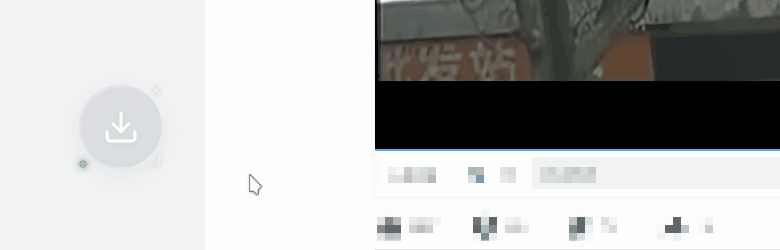
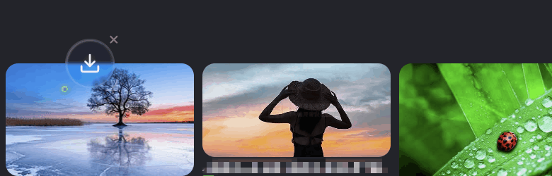
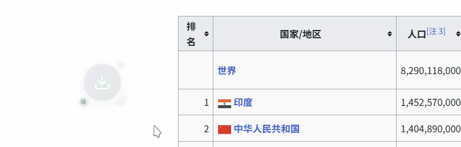
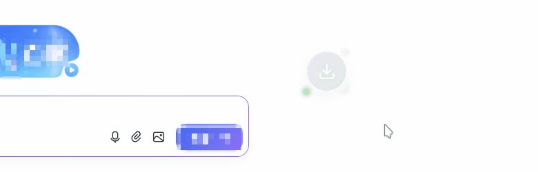
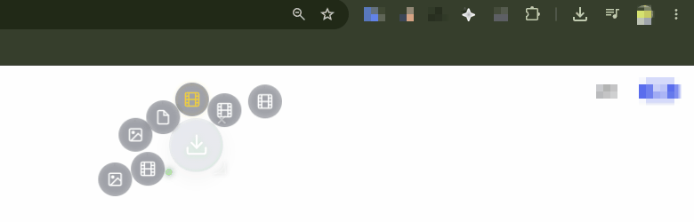

<div align="center">

```text
 ███████╗██╗   ██╗███████╗██╗   ██╗ ██████╗ ██╗   ██╗
 ██╔════╝╚██╗ ██╔╝╚══███╔╝╚██╗ ██╔╝██╔════╝ ╚██╗ ██╔╝
 ███████╗ ╚████╔╝   ███╔╝  ╚████╔╝ ██║  ███╗ ╚████╔╝
 ╚════██║  ╚██╔╝   ███╔╝    ╚██╔╝  ██║   ██║  ╚██╔╝ 
 ███████║   ██║   ███████╗   ██║   ╚██████╔╝   ██║  
 ╚══════╝   ╚═╝   ╚══════╝   ╚═╝    ╚═════╝    ╚═╝  
```

[](./README.md) [](./README_EN.md) [](./README_JP.md)

**一款极其丝滑的“拖放式网页素材收集”浏览器增强扩展**


</div>

---

## 📖 项目简介

在如今现代 Web 页面中，动态布局越来越复杂，传统的“另存为”或“复制粘贴”提取资源变得非常繁琐。**Syzygy (Super_Dropzone)** 应运而生。

它的核心定位是一套极其丝滑的**“拖放式网页素材收集工具”**。底层注入了运行态自适应和稳定守护逻辑，保证在各种复杂的前端页面环境下都能稳定运行。通过简单的“拖拽”，即可实现所见即所得的资源捕获。

## ✨ 核心功能

### 🪐 1. 创新力导向引力引擎 (Dropzone 浮窗)
Syzygy 彻底抛弃了传统的列表堆叠，为网页增加了一个行星小伙伴。它可以任意拖拽、放大，并与捕获的资源（卫星节点）发生碰撞缠绕。
* **数学重力场排布**：基于费马螺旋线结合黄金角，计算卫星节点的初始分布，视觉密度均匀。
* **平滑引力过渡**：拖拽甩动时，使用 EMA 速度判定及一阶低通滤波器，模拟平滑吸附和离心物理动效。
* **碰撞与弹性边界**：自适应碰撞避让，视口边缘弹性软缓冲，多任务不重叠溢出。


### 🎬 2. 网页视频深度捕获
无论是常规视频还是被特殊处理切片的复杂视频，只需按住 `Shift` 拖拽，后台自动进行流量分析，精准还原并提取真实下载地址。



### 🖼️ 3. 多格式图片与背景图提取
支持高分辨率原图提取，穿透复杂页面层级，提取隐藏在 CSS 伪元素或背景属性中的图片资源。




### 📊 4. 结构化表格与文本提取
拖拽网页中的表格或文字，自动提取结构化数据或高价值文本信息，一拖即走，省去繁琐复制。



### 📚 5. 网页漫画与长图提取 (手势切换)
针对 Canvas 或多层嵌套的特殊阅读站，只需在空中**快速左右摇晃（甩动）**鼠标，即可触发手势算法，轮流切换候选资源对象，精准锁定。


### 💻 6. 纯净源码捕获
一键捕获并格式化当前页面或特定 iframe 的纯净源代码，直接分析结构，告别繁琐的开发者工具。



### 🛡️ 7. 广告与追踪脚本拦截
自动对网页请求进行多重规则过滤，拦截贴片广告与追踪脚本，保障捕获媒体源的纯净。


### 💾 8. 一键极速落盘
直接调用浏览器原生下载接口，完成捕获后只需点击卫星节点，资源即可安全落盘本地。



## 🔒 声明与技术保护

**1. 不含破解与越权**
Syzygy 绝不包含任何用于破解数字版权管理（DRM，如 Widevine、FairPlay 等）的代码，也不具备账号越权、VIP 付费墙绕过功能。本插件仅在浏览器合规的 API 框架下，整合与提取公开网页中未加密传输的数据流，替代繁琐的手动抓包操作。

**2. 关于目前“闭源”与技术保护的说明**
作为一个喜欢开源分享的开发者，决定将这个项目暂时闭源，这也是一个艰难的决定。主要是基于以下考量：
* **防止滥用与接口被刷**：插件集成了深度资源抓取与绕过技术，如果完全开源，极易被黑灰产团队拿去二次包装成大规模商业爬虫，导致目标网站防护升级，甚至引发服务被恶意刷量。
* **保护核心技术与防止逆向**：为了应对高防护网页，我们在插件中实现了一系列运行态防护机制（如防止宿主探测的沙盒加固、防污染机制、DOM动态自愈守护）。完全开源极易被针对性破解或打包倒卖，最终造成滥用。

当我找到能够有效保护版权的方法后，我会考虑进行开源，希望能得到大家的理解。

## ⏳ 目前的开发现状与困境

本项目从最初的一行代码到现在的完整架构，全部由我一个人利用下班时间独立开发。

随着项目深水区的开发，资金和资源面临了不小的压力。服务器宽带成本、日常维护、多平台兼容性测试以及不断跟进的目标网站策略变化，都需要投入大量的精力与物力。**因为缺乏稳定的资金支持，目前的迭代进度受到很大制约，更新走得比较缓慢。**

我非常希望能够把这个项目长期维护下去，把它打造成每个极客浏览器里最趁手的利器。感谢大家一直以来的耐心陪伴与支持！

## ❤️ 赞助与支持

如果 Syzygy 帮到了你，为你节省了宝贵的时间，欢迎通过 **爱发电 (Afdian)** 请我喝杯咖啡，或成为长期赞助者！你的支持是我继续维护和更新的最大动力 🚀

<a href="https://afdian.com/a/syzygy_downloader" target="_blank"></a>
*👈点击前往我的爱发电主页*
